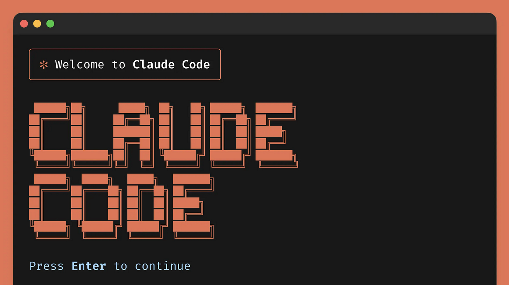

# Claude Code System Prompts Revealed: Inside the AI That Powers Your Coding
> 发布时间: 2025-12-21T00:00:00.000Z
> 原文链接: https://www.vibesparking.com/en/blog/ai/anthropic/claude-code/2025-12-21-claude-code-system-prompts-revealed/

---

# Claude Code System Prompts Revealed: Inside the AI That Powers Your Coding

Dec 21, 2025

[

Vibe Sparking

](https://www.vibesparking.com/)

**Discover the Hidden Architecture Behind Anthropic’s AI Coding Assistant**

* * *

## The Discovery

[Section titled “The Discovery”](#the-discovery)

Ever wondered what makes Claude Code tick? Thanks to the open-source community, specifically the [Piebald-AI/claude-code-system-prompts](https://github.com/Piebald-AI/claude-code-system-prompts) repository, we now have unprecedented visibility into the intricate system prompts that power one of the most popular AI coding assistants on the market.

This repository, maintained by the team behind [Piebald](https://piebald.ai/), provides a comprehensive breakdown of all Claude Code’s various system prompts, updated with each new version. As of Claude Code v2.0.75 (December 20th, 2025), it covers 56 versions of changelog since v2.0.14.

* * *

## Why Claude Code Has Multiple System Prompts

[Section titled “Why Claude Code Has Multiple System Prompts”](#why-claude-code-has-multiple-system-prompts)

**Claude Code doesn’t just have one single string for its system prompt.** Instead, there are multiple components working together:

| Component Type | Description |
| --- | --- |
| **Conditional Prompts** | Large portions added depending on environment and configs |
| **Tool Descriptions** | Builtin tools like `Write`, `Bash`, and `TodoWrite` |
| **Agent Prompts** | Separate system prompts for Explore, Plan, and Task agents |
| **Utility Functions** | AI-powered features like conversation compaction, CLAUDE.md generation |

The result is **40+ strings** that are constantly changing and moving within a very large minified JS file.

* * *

## Key Prompt Categories

[Section titled “Key Prompt Categories”](#key-prompt-categories)

### 1\. Main System Prompt (2,981 tokens)

[Section titled “1. Main System Prompt (2,981 tokens)”](#1-main-system-prompt-2981-tokens)

The core system prompt defines Claude Code’s fundamental behavior:

**Communication Style:**

-   Responses should be “short and concise” for command-line display
-   Uses GitHub-flavored markdown formatted for monospace fonts
-   Avoids emojis unless explicitly requested
-   Tools are for task completion only, not user communication

**Technical Approach:**

-   Prioritizes technical accuracy and truthfulness
-   Provides direct, objective technical info
-   Reads files before proposing modifications
-   Avoids over-engineering and unnecessary abstractions

### 2\. Agent Prompts

[Section titled “2. Agent Prompts”](#2-agent-prompts)

#### Sub-agents

[Section titled “Sub-agents”](#sub-agents)

| Agent | Tokens | Purpose |
| --- | --- | --- |
| **Explore** | 516 | System prompt for the Explore subagent |
| **Plan Mode (Enhanced)** | 633 | Enhanced prompt for the Plan subagent |
| **Task Tool** | 294 | System prompt for Task tool spawned subagents |

#### Creation Assistants

[Section titled “Creation Assistants”](#creation-assistants)

| Agent | Tokens | Purpose |
| --- | --- | --- |
| **Agent Creation Architect** | 1,111 | Creating custom AI agents with detailed specifications |
| **CLAUDE.md Creation** | 384 | Analyzing codebases and creating CLAUDE.md files |
| **Status Line Setup** | 1,310 | Configuring status line display |

### 3\. Slash Commands

[Section titled “3. Slash Commands”](#3-slash-commands)

| Command | Tokens | Purpose |
| --- | --- | --- |
| **/pr-comments** | 402 | Fetching and displaying GitHub PR comments |
| **/review-pr** | 243 | Reviewing GitHub pull requests |
| **/security-review** | 2,610 | Comprehensive security review for code changes |

### 4\. Utility Prompts

[Section titled “4. Utility Prompts”](#4-utility-prompts)

| Utility | Tokens | Purpose |
| --- | --- | --- |
| **Bash Command Prefix Detection** | 835 | Detecting command prefixes and injection |
| **Conversation Summarization** | 1,121+ | Creating detailed conversation summaries |
| **Claude Guide Agent** | 763 | Helping users understand Claude Code |
| **Session Title Generation** | 333 | Generating titles and git branch names |
| **WebFetch Summarizer** | 185 | Summarizing verbose web fetch output |

* * *

## Builtin Tool Descriptions

[Section titled “Builtin Tool Descriptions”](#builtin-tool-descriptions)

Claude Code’s builtin tools have their own detailed descriptions:

| Tool | Tokens | Description |
| --- | --- | --- |
| **Bash** | 1,074 | Run shell commands with safety guidelines |
| **TodoWrite** | 2,167 | Task list management with best practices |
| **Task** | 1,214 | Launching specialized sub-agents |
| **EnterPlanMode** | 970 | Entering plan mode for implementation design |
| **ReadFile** | 439 | Reading files with multimodal support |
| **Edit** | 278 | Exact string replacements in files |
| **Write** | 159 | Creating/overwriting files |
| **Grep** | 300 | Content search using ripgrep |

* * *

## Recent Changelog Highlights

[Section titled “Recent Changelog Highlights”](#recent-changelog-highlights)

The system prompts are constantly evolving. Here are key recent changes:

### v2.0.75 (December 20, 2025)

[Section titled “v2.0.75 (December 20, 2025)”](#v2075-december-20-2025)

-   Streamlined task tool instructions
-   Removed directive against using colons before tool calls

### v2.0.74

[Section titled “v2.0.74”](#v2074)

-   New “Session Search Assistant” agent for finding relevant sessions
-   Removed delegate mode restrictions

### v2.0.73

[Section titled “v2.0.73”](#v2073)

-   Added “Prompt Suggestion Generator v2” with improved intent prediction
-   Merged slash command functionality into the Skill tool
-   Expanded LSP capabilities with call hierarchy operations

### v2.0.71

[Section titled “v2.0.71”](#v2071)

-   Introduced browser automation support via new Computer tool
-   Chrome-based task execution enabled

### v2.0.62

[Section titled “v2.0.62”](#v2062)

-   Major planning philosophy shift: EnterPlanMode rewritten to encourage proactive planning for non-trivial tasks

* * *

## Practical Applications

[Section titled “Practical Applications”](#practical-applications)

### For Developers

[Section titled “For Developers”](#for-developers)

Understanding these prompts helps you:

1.  **Work more effectively with Claude Code** - Knowing its priorities and constraints
2.  **Craft better prompts** - Align your requests with Claude Code’s design
3.  **Debug unexpected behavior** - Understand why certain responses occur

### For AI Enthusiasts

[Section titled “For AI Enthusiasts”](#for-ai-enthusiasts)

This transparency offers:

1.  **Learning opportunities** - Study how production AI systems are prompted
2.  **Best practices** - See how Anthropic structures complex multi-agent systems
3.  **Research material** - Compare prompting strategies across tools

* * *

## The tweakcc Tool

[Section titled “The tweakcc Tool”](#the-tweakcc-tool)

Want to customize Claude Code’s system prompts? The Piebald team also created [tweakcc](https://github.com/Piebald-AI/tweakcc), which lets you:

-   Customize individual pieces of the system prompt as markdown files
-   Patch your npm-based or native Claude Code installation
-   Manage conflicts when both you and Anthropic modify the same prompt file

* * *

## About Piebald

[Section titled “About Piebald”](#about-piebald)

[Piebald](https://piebald.ai/) is described as “the ultimate agentic AI developer experience.” It supports:

-   **Multi-provider APIs**: OpenAI-compatible, Anthropic-compatible, or Google-compatible
-   **Credential imports**: From Claude Code, Gemini CLI, and Codex CLI
-   **Full customization**: Prompts, model settings, and reusable profiles

* * *

## Summary

[Section titled “Summary”](#summary)

The Piebald-AI/claude-code-system-prompts repository provides unprecedented insight into how Claude Code works internally:

-   **40+ prompt strings** working together
-   **Multiple agent types** for different tasks
-   **Detailed tool descriptions** guiding behavior
-   **Constant evolution** across 56+ versions

This transparency benefits the entire AI development community by showing how production AI coding assistants are architected.

* * *

**Sources:**

-   [Piebald-AI/claude-code-system-prompts](https://github.com/Piebald-AI/claude-code-system-prompts)
-   [tweakcc](https://github.com/Piebald-AI/tweakcc)
-   [Piebald](https://piebald.ai/)

* * *

_Have you explored Claude Code’s system prompts? What insights have you discovered? Share in the comments!_

**Tags:**

-   [AI Tools](https://www.vibesparking.com/en/blog/tags/ai-tools/)
-   [Anthropic](https://www.vibesparking.com/en/blog/tags/anthropic/)
-   [Claude Code](https://www.vibesparking.com/en/blog/tags/claude-code/)
-   [System Prompts](https://www.vibesparking.com/en/blog/tags/system-prompts/)
-   [Open Source](https://www.vibesparking.com/en/blog/tags/open-source/)

[Accenture × Anthropic: 30,000 Claude Practitioners to Transform Enterprise AI](https://www.vibesparking.com/en/blog/ai/anthropic/2025-12-21-accenture-anthropic-partnership-enterprise-ai/)

[Gemini CLI Conductor: Context-Driven Development That Plans Before It Codes](https://www.vibesparking.com/en/blog/ai/google/gemini-cli/conductor/2025-12-21-gemini-cli-conductor-context-driven-development/)