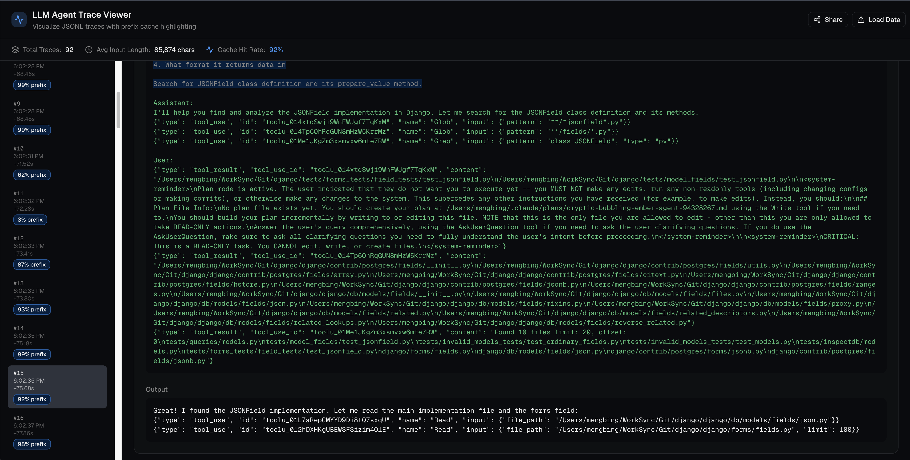
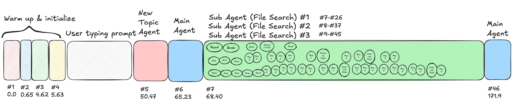
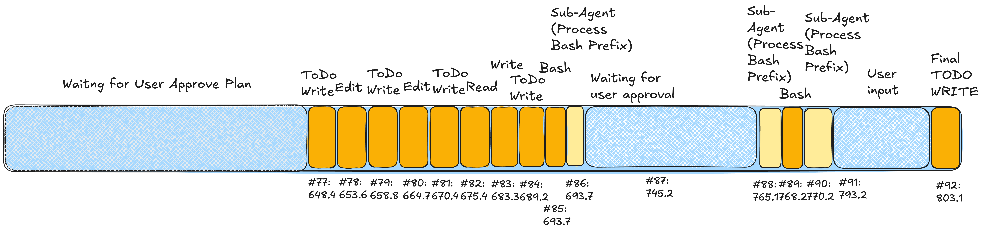
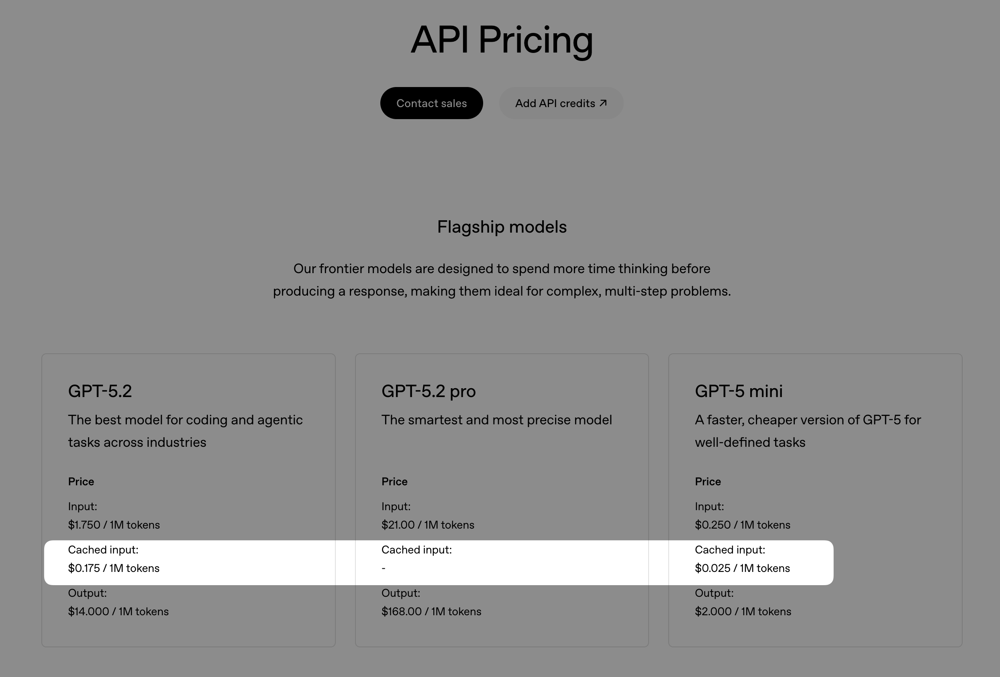
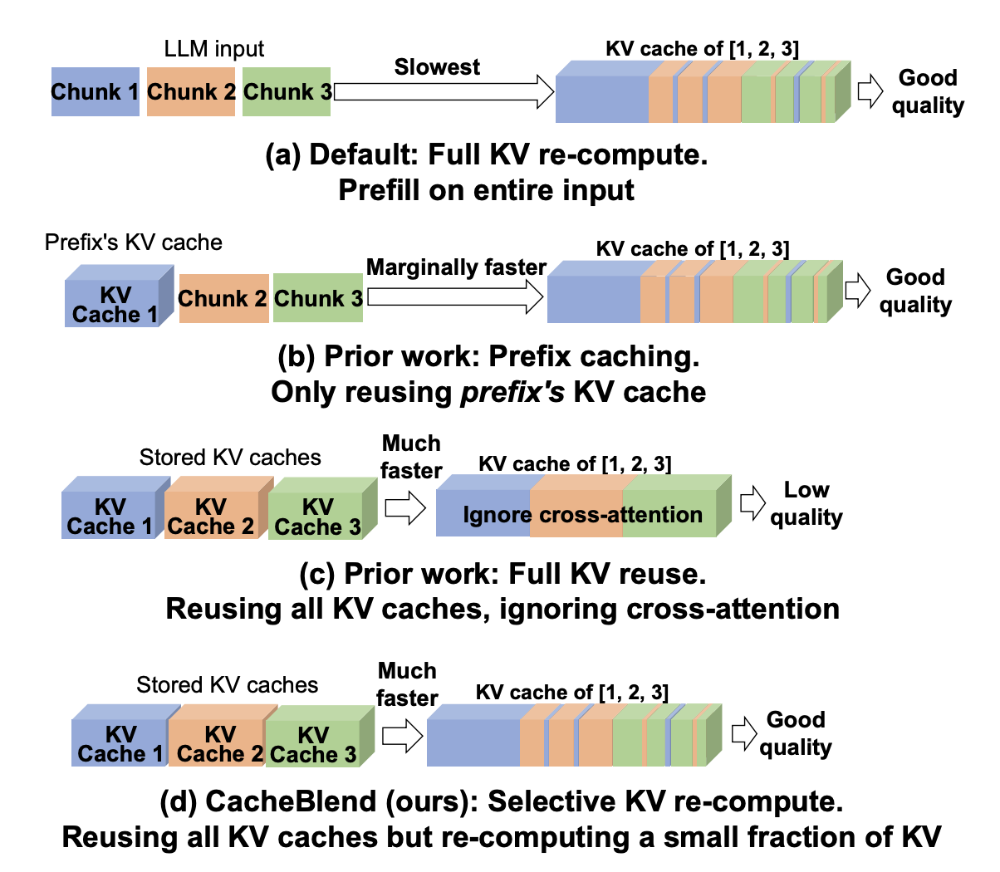

# Context Engineering & Reuse Pattern Under the Hood of Claude Code
> 发布时间: 2025-02-18T23:48:55
> 原文链接: https://huggingface.co/blog/kobe0938/context-engineering-reuse-pattern-claude-code

---

[Back to Articles](https://huggingface.co/blog)

# Context Engineering & Reuse Pattern Under the Hood of Claude Code

[Community Article](https://huggingface.co/blog/community) Published December 22, 2025

 Upvote

7

-   
-   
-   
-   
-   
-   
-   +1

[Kobe Chen

kobe0938

Follow

](https://huggingface.co/kobe0938)

Over the last few months, [Claude Code](https://www.claude.com/product/claude-code) has quietly become one of the most interesting & widely-adopted real-world agentic systems available to normal developers.

Unlike _**cloud-only agents**_ whose internals remain hidden behind API gateways like [Perplexity](https://www.perplexity.ai/api-platform), [Devin](https://devin.ai/), or [Manus](https://manus.im/), nor as fully _**open source agents**_ like [Mini SWE Agent](https://github.com/SWE-agent/mini-swe-agent) or [Terminus 2](https://github.com/laude-institute/harbor/blob/main/src/harbor/agents/terminus_2/terminus_2.py) where you can deploy locally with source code, Claude Code runs _**partially locally**_ — it has a open-sourced [client repo](https://github.com/anthropics/claude-code) running on the local machine, which gives us a rare opportunity: to inject the traffic it sends and reverse engineering **to see every single LLM call**, every intermediate **tool invocation**, every tiny decision the agent makes.

Recently, we ran a tiny one-shot experiment (one random task from the [SWE-bench\_Verified](https://huggingface.co/datasets/princeton-nlp/SWE-bench_Verified) dataset) with Claude Code and captured everything into a **raw** log file with only LLM input&output: [**`claude_code_trace.jsonl`**](https://github.com/kobe0938/blog/blob/master/claude-code/claude_code_trace.jsonl). If you paste [this trace](https://github.com/kobe0938/blog/blob/master/claude-code/claude_code_trace.jsonl) into the [visualizer](https://v0-llm-agent-dashboard.vercel.app/), you can see the trace details.

**Key metrics:**

-   **92 LLM calls** (`#1-#92`)
-   **~2M input tokens** consumed
-   **13 minutes** total duration
-   **92% prefix reuse rate**

The goal was simple:

> If you give Claude Code one small task, what exactly happens behind the scenes?
>
> Which LLM calls get made? In what order?
>
> Where does context get reused? And how much of the prompt is stable prefix(seen) vs incremental content(new)?

This is our walk-through of that trace.

* * *

# **1\. What “Actually Happens” When Claude Code Runs a Simple Task**

Claude Code feels straightforward as a product — you type a request in your editor, it edits files or runs some bash commands. But under the hood, even a simple one-step request decomposes into a surprisingly structured internal loop.

We randomly select one [task (#80)](https://huggingface.co/datasets/princeton-nlp/SWE-bench_Verified/viewer/default/test?views%5B%5D=test&row=80) from the [SWE-bench\_Verified](https://huggingface.co/datasets/princeton-nlp/SWE-bench_Verified) dataset. The problem setup is to fix an issue in the `django/django` repo from commit `2e0f04507b17362239ba49830d26fec504d46978`.

**Problem statement:**

> _"JSONField are not properly displayed in admin when they are readonly._
>
> _Description: JSONField values are displayed as dict when readonly in the admin. For example, `{"foo": "bar"}` would be displayed as `{'foo': 'bar'}`, which is not valid JSON._
>
> _I believe the fix would be to add a special case in `django.contrib.admin.utils.display_for_field` to call the `prepare_value` of the JSONField (not calling `json.dumps` directly to take care of the `InvalidJSONInput` case)."_

And this is exactly the prompt that Claude Code received.

Surprisingly, before any fancy reasoning, Claude Code ran a couple of **"warm-up" steps** (trace ID `#2`, `#3`, `#4`) before the actual task. Warm-up steps do nothing but input the prompt for:

-   Tool list (`#2`)
-   Explore subagent (`#3`)
-   Plan subagent (`#4`)

Warm-up steps are used for caching purposes—later when those tools and subagents are called, the cache will be hit, resulting in faster response time. The summarization agent (`#1`) and new topic agent (`#5`) are used for summarizing the context and generating a new title for display—just as the ChatGPT sidebar works.

The main agent (`#6`) comes with a huge system prompt, including git history, status, tool list, etc. The **18 tools** in the tool list not only have the ability to use normal tool calls like `Bash`, `Grep`, `Read`, `WebFetch`, `AskUserQuestion`, etc., but also the ability to invoke and delegate certain tasks to subagents like:

-   Explore subagent (`#7`)
-   Plan subagent (`#46`)

These subagents will invoke tool calls from their own tool lists.

Immediately after the main agent (`#6`), it invokes the **Explore** (also called file search agent) subagent (`#7`), which will invoke tool calls from its tool list to explore the codebase. It starts with a different system prompt where its main goal is to explore the codebase:

> You are Claude Code, Anthropic's official CLI for Claude. You are a file search specialist for Claude Code, Anthropic's official CLI for Claude. You excel at thoroughly navigating and exploring codebases.

Interestingly, the Explore subagent (`#7`) is not the only subagent that Claude Code can invoke. Instead, it invokes **3 Explore subagents in parallel** to explore the codebase, each with a different goal:

1.  **Explore JSONField implementation** (lifespan: `#7-#26`)
2.  **Explore admin display\_for\_field** (lifespan: `#8-#37`)
3.  **Explore readonly field rendering** (lifespan: `#9-#45`)

The context of the main agent (`#6`) is **not** carried to the subagents, which is beneficial for the subagents to have a fresh start. Each Explore subagent can invoke **1-3 tools in parallel**, where the tools are from the tool list of the Explore subagent—a subset (**10/18**) of the main agent's tool list.

The [ReAct](https://arxiv.org/pdf/2210.03629) mechanism is used here: the Explore subagent will invoke a tool call, then based on the tool output, it will observe and invoke another tool call to explore the codebase further until it deems it has explored enough.

Finally, after the slowest Explore subagent finishes its exploration at step `#45`, at step `#46`, the main agent appends the findings (summarizations) from all 3 Explore subagents to the context, and then invokes the Plan subagent (`#47`) to plan the fix.

* * *

Similar to the Explore Agent, the Plan Agent (`#47`) also has a different system prompt, where its main goal is to plan the fix:

> You are Claude Code, Anthropic's official CLI for Claude. You are a software architect and planning specialist for Claude Code. Your role is to explore the codebase and design implementation plans.

The Plan Agent did not carry all the context from the main agent nor the Explore subagents, which is beneficial for the Plan Agent to have a fresh start. Instead, it only contains the **summarization** of the Explore subagents' findings. The toolbox is a subset (**10/18**) of the main agent's tool list. The goal for the Plan Agent is to design an implementation plan that:

> Please design an implementation plan that:
>
> 1.  Identifies the exact changes needed to display\_for\_field
> 2.  Considers whether we need to instantiate a form field from the model field or if there's a better approach
> 3.  Identifies any edge cases or potential issues
> 4.  Recommends the best approach given Django's architecture

* * *

Similarly, the Plan Agent also follows the ReAct pattern and loops through tool calling from `#47` to `#72`, where the context accumulates from **11,552 tokens** to **38,819 tokens**. After having a good plan (see details in `#72`), the Plan Agent will return to the main agent (`#73`) with the plan.

The main agent will then invoke a series of tool calls to:

-   Review the plan (`#73`)
-   Ask user for clarification (`#74`)
-   Write the plan into a markdown file (`#75`)

Finally, the main agent will exit the plan mode (`#76`) and enter the execute mode (`#77`) to execute the plan after interactively asking the user for plan approval (`#76-#77`).

The **execution phase** (`#77-#91`) still follows the ReAct pattern. The main agent will use the plan markdown file as a todo list:

> 1.  Add json import to `utils.py`
> 2.  Add JSONField handling to `display_for_field()`
> 3.  Add tests to `test_admin_utils.py`
> 4.  Run the tests to verify

After executing some tool calls to read or edit files, it will cross out the todo items in the plan markdown file. Once all the todo items are crossed out, the main agent will end with a conclusion message (`#92`).

During this phase, there are some other subagents being invoked—e.g., the **Extract Bash Command** subagent (`#93`), where there's only a one-shot prompt template for the subagent to extract the bash command in order to not run dangerous commands like `rm` without user confirmation by accident.

And this is the whole diagram of the claude code trace:

* * *

# **2\. The Secret Pattern: Claude Code Is a Prefix Reuse Machine**

During our trace analysis, one phenomenon was so consistent it deserves its own section:

> **Claude Code’s prompts are extremely prefix-heavy.**

Prefix reuse means that one part of the prompt prefix is seen in the previous prompts' prefix. Across all phases, the prompt reuse rate is extremely high: **92%**. For ReAct-based subagent loops, it's even higher. If we run prefix-length analysis in particular sections:

| Trace ID | Total Tokens | Shared Prefix % | Notes |
| --- | --- | --- | --- |
| `#1-#6` | 47,177 | 0.22% | Warm-up and initial phase |
| `#7-#45` | 546,104 | 92.06% | Explore subagent phase |
| `#47-#72` | 528,286 | 93.23% | Plan subagent phase |
| `#73-#92` | 827,411 | 97.83% | Main agent execution phase |

What does this mean? Claude Code’s architecture practically **optimizes itself for KV cache reusage**, even without explicitly trying.

* * *

# **3\. What is prefix caching and why should I care?**

At the heart of Large Language Model inference lies the **KV cache** (key-value cache) — a mechanism that stores intermediate attention computation results for previously processed tokens. During autoregressive generation, each new token needs to attend to all previous tokens, requiring expensive matrix multiplications. The KV cache stores the key and value matrices computed for earlier tokens, so they don't need to be recomputed with each new token.

**Prefix caching** leverages this by recognizing that when multiple requests share the same prompt prefix (like system instructions or document context), their KV cache computations are identical and can be reused across requests.

Major LLM providers have turned this into significant cost savings:

-   **[OpenAI's Prompt Caching](https://platform.openai.com/docs/guides/prompt-caching)** handles prefix caching **automatically** — it detects common prefixes longer than 1,024 tokens and caches them transparently, offering a **90% discount** on cached input tokens (e.g., GPT-5.2 drops from $1.75 to $0.175 per million cached tokens) 
-   **[Anthropic's cache hit pricing](https://platform.claude.com/docs/en/build-with-claude/prompt-caching)** gives developers **explicit control** over which prompt blocks to cache using special `cache_control` markers, charging a slightly higher cache write cost (1.25x base price for 5-minute cache, 2x for 1-hour cache) but delivering the same **90% discount** on cache reads (Claude Sonnet 4.5: $0.30 per million tokens for cache reads versus $3.00 for base input), allowing fine-grained optimization for complex multi-turn conversations or document-heavy workflows 

To put this in perspective with Claude Code's 92% prefix reuse pattern: processing 2M input tokens (our consumption for the experiment) **without caching** would cost **$6.00** (2M × $3/MTok), but **with prefix caching**, the cost drops to just **$1.152** (1.84M cache hits × $0.30/MTok + 0.16M cache writes × $3.75/MTok) — a savings of **$4.85 (81% reduction)** over one simple task.

Open-source inference engines have also embraced this paradigm:

-   **[vLLM's automatic prefix caching](https://docs.vllm.ai/en/latest/features/automatic_prefix_caching/)** transparently caches shared prefixes using its PagedAttention mechanism
-   **[SGLang's RadixAttention](https://docs.sglang.io/advanced_features/hicache_best_practices.html)** employs a radix tree data structure to efficiently match and reuse the longest common prefixes across requests
-   **[LMCache](https://github.com/LMCache/lmcache)** takes distributed KV caching even further by pooling cache storage across multiple nodes to maximize reuse at scale

Beyond cost savings, prefix cache hits dramatically reduce **TTFT (time to first token)** — since the model can skip recomputing the entire prefix and only process the unique suffix, latency for subsequent requests with shared context can drop by 5-10x, making conversational agents and document-grounded applications far more responsive.

* * *

# **4\. What We Learned from This Tiny Trace**

Even though the task was trivial, the trace reveals a lot about Claude Code as a system:

**The main system prompt is huge**

-   It contains: Complete git repository state and history + full tool specifications (18 tools for main agent) + finally, execution phase instructions
-   The prompt alone is **20,000+ tokens** without conversation history

**Claude Code is built around specialized subagents**

-   Subagents receive only role-specific context, reducing bloat
-   Separation of context allows the main agent to only run on the summarized subagent responses

**Parallel execution is used to maximize exploration efficiency**

-   Subagents are spawned in parallel with different search goals under their own ReAct loop
-   This separation allows clean context and focused subtasks, distributing context evenly
-   Tool calls are also run in parallel for the same benefits

**"Warm-up" calls prime the cache before real work begins**

-   They load tool specifications into cache, prime subagent system prompts, and establish stable prefix baselines
-   These calls drastically accelerate subsequent subagent invocations

**Claude works well with KV cache reuse**

-   Claude reaches up to **92% overall prefix reuse**, perfect for KV cache reuse optimization
-   Results in a significant cost savings of **$4.85 (81% reduction)** over one simple task

**Interactive planning improves transparency**

-   Gives users control over what changes will be made
-   Creates a natural breakpoint prompting the user for approval
-   Responses allow the system to create a more refined executable todo list, improving workflow

* * *

# **5\. Beyond Prefix Caching: Can We Do Better?**

Recently, there are some interesting research papers that try to improve non-prefix caching efficiency, such as [CacheBlend](https://arxiv.org/abs/2405.16444), where optimizations can be made even on non-prefix (substring) caching.

In our trace, we can see that the subagents have a tool list that is a subset of the main agent's tool list, which means that the subagents can reuse the main agent's tool list descriptions. This is a good example of how to improve non-prefix caching efficiency.

Another scenario in our trace is that if the same file was read multiple times, the file content can be cached and reused, even though the file content is not a prefix. This can be extremely helpful when the file content is large and the file is read multiple times.

## Datasets mentioned in this article 1

### Community

[programmerraja](https://huggingface.co/programmerraja)

[Jan 17](#696b89f45c9fbbd912b37b08)

Thanks for sharing it just awsome. i would like know more about how you guys trace the prompt and would like know more about [https://v0-llm-agent-dashboard.vercel.app/](https://v0-llm-agent-dashboard.vercel.app/) can anyone help me to get it

Reply

EditPreview

Upload images, audio, and videos by dragging in the text input, pasting, or clicking here.

Tap or paste here to upload images

Comment

 Upvote

7

-   
-   
-   
-   
-   
-   
-   

## Datasets mentioned in this article 1