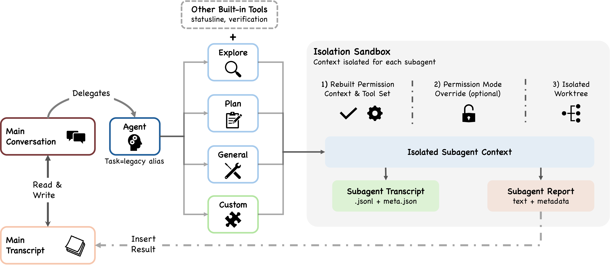

# Dive-into-Claude-Code/docs/architecture.md at main · VILA-Lab/Dive-into-Claude
> 原文链接: https://github.com/VILA-Lab/Dive-into-Claude-Code/blob/main/docs/architecture.md

---

[Back to Main README](https://github.com/VILA-Lab/Dive-into-Claude-Code/blob/main/README.md)

# Architecture Overview

> The core agent loop is a simple while-loop. Most of the code lives in the systems around it.

## Four Design Questions Every Coding Agent Must Answer

| Design Question | Claude Code's Answer | Alternatives |
| :-- | :-- | :-- |
| **Where does reasoning live?** | Model reasons; harness enforces. ~1.6% AI decision logic, 98.4% infrastructure. | LangGraph: explicit state graphs. Devin: multi-step planners. |
| **How many execution engines?** | One `queryLoop` for all interfaces (CLI, SDK, IDE). | Mode-specific engines per surface. |
| **What is the default safety posture?** | Deny-first: deny > ask > allow. Strictest rule wins. | Container isolation (SWE-Agent), git rollback (Aider). |
| **What is the binding resource constraint?** | ~200K-token context window. 5 compaction strategies run before every model call. | Compute budget, explicit scratchpad. |

## High-Level System Structure (7 Components)

1.  **User** -- Submits prompts, approves permissions, reviews output
2.  **Interfaces** -- Interactive CLI, headless CLI (`claude -p`), Agent SDK, IDE/Desktop/Browser
3.  **Agent Loop** -- `queryLoop` async generator in `query.ts`: model call → tool dispatch → result collection → repeat
4.  **Permission System** -- Deny-first rules + auto-mode ML classifier + hook interception
5.  **Tools** -- Up to 54 built-in + MCP-provided, assembled via `assembleToolPool`
6.  **State & Persistence** -- Append-only JSONL transcripts, prompt history, subagent sidechains
7.  **Execution Environment** -- Shell (with sandbox), filesystem, web fetching, MCP connections

All interfaces converge on the same `queryLoop` -- the interactive CLI, headless mode, SDK, and IDE all share the same code path. `QueryEngine` is a conversation wrapper, not the engine itself.

## 5-Layer Subsystem Decomposition (21 Subsystems)

| Layer | Responsibility | Key Components |
| :-- | :-- | :-- |
| **Surface** | Entry points & rendering | CLI, headless, SDK, IDE (React + Ink terminal UI) |
| **Core** | Context assembly & agent loop | `queryLoop`, 5-stage compaction pipeline, subagent spawning |
| **Safety/Action** | Permissions & tools | 7 permission modes, auto-mode classifier, 27 hook events, tool pool, shell sandbox |
| **State** | Runtime state & persistence | JSONL transcripts, CLAUDE.md hierarchy, auto-memory, sidechain files |
| **Backend** | Execution environments | Shell execution, MCP connections (7 transport types), 42 tool subdirectories |

## Seven Independent Safety Layers

A request must pass through **all** applicable layers -- any single layer can block it:

1.  **Tool pre-filtering** -- Blanket-denied tools removed from model's view entirely
2.  **Deny-first rule evaluation** -- Deny always overrides allow, even when allow is more specific
3.  **Permission mode constraints** -- Active mode determines baseline handling
4.  **Auto-mode ML classifier** -- Separate LLM call evaluating safety independently
5.  **Shell sandboxing** -- Filesystem + network isolation for shell commands
6.  **Non-restoration on resume** -- Permissions never persist across session boundaries
7.  **Hook-based interception** -- PreToolUse hooks can modify or block actions

## Turn Execution: 9-Step Pipeline

Each turn follows a **9-step pipeline**:

1.  Settings resolution → 2. State initialization → 3. Context assembly → 4. Five pre-model shapers → 5. Model call → 6. Tool dispatch → 7. Permission gate → 8. Tool execution → 9. Stop condition check

### Five Pre-Model Context Shapers

Executed **sequentially before every model call**, cheapest first:

| Stage | Strategy | Trigger |
| :-- | :-- | :-- |
| Budget Reduction | Per-message size caps | Always active |
| Snip | Trim older history | Feature-gated (`HISTORY_SNIP`) |
| Microcompact | Cache-aware fine-grained compression | Always (time-based), optional cache-aware path |
| Context Collapse | Read-time virtual projection (non-destructive) | Feature-gated (`CONTEXT_COLLAPSE`) |
| Auto-Compact | Full model-generated summary (last resort) | When all else fails |

### Recovery Mechanisms

-   Max output token escalation (up to 3 retries per turn)
-   Reactive compaction (fires at most once per turn)
-   Prompt-too-long: tries context-collapse overflow → reactive compaction → terminate
-   Streaming fallback and fallback model switching

## Permission System Deep Dive

### 7 Permission Modes

| Mode | Behavior | Trust Level |
| :-- | :-- | :-- |
| `plan` | User approves all plans before execution | Lowest |
| `default` | Standard interactive approval | Low |
| `acceptEdits` | File edits + filesystem shell auto-approved | Medium |
| `auto` | ML classifier evaluates tool safety | High |
| `dontAsk` | No prompting, deny rules still enforced | Higher |
| `bypassPermissions` | Skips most prompts, safety-critical checks remain | Highest |
| `bubble` | Internal: subagent escalation to parent | Special |

### Authorization Pipeline

4-stage flow: **Pre-filtering** (strip denied tools from model's view) → **PreToolUse hooks** (can return `permissionDecision`) → **Rule evaluation** (deny-first) → **Permission handler** (4 branches: coordinator, swarm worker, speculative classifier, interactive)

### Auto-Mode Classifier

`yoloClassifier.ts`: loads base system prompt + permission templates (separate internal/external). Two-stage evaluation: fast-filter + chain-of-thought. Races pre-computed classification against a timeout.

## Extensibility: MCP, Plugins, Skills, and Hooks

### Four Extension Mechanisms (Graduated Context Cost)

| Mechanism | Context Cost | Key Capability |
| :-- | :-- | :-- |
| **Hooks** | Zero | 27 events, 4 execution types (shell, LLM, webhook, subagent verifier) |
| **Skills** | Low | SKILL.md with 15+ YAML frontmatter fields, injected via SkillTool meta-tool |
| **Plugins** | Medium | 10 component types (commands, agents, skills, hooks, MCP, LSP, styles...) |
| **MCP Servers** | High | External tools via 7 transport types (stdio, SSE, HTTP, WebSocket, SDK, IDE) |

### Tool Pool Assembly (5-step pipeline)

Base enumeration (up to 54 tools) → Mode filtering → Deny rule pre-filtering → MCP integration → Deduplication

### Three Injection Points

-   **assemble()** -- What the model sees: CLAUDE.md, skill descriptions, MCP resources, hook-injected context
-   **model()** -- What the model can reach: built-in tools, MCP tools, SkillTool, AgentTool
-   **execute()** -- Whether/how an action runs: permission rules, PreToolUse/PostToolUse hooks, Stop hooks

## Context Construction and Memory

### 9 Ordered Context Sources

System prompt → Environment info → CLAUDE.md hierarchy → Path-scoped rules → Auto-memory → Tool metadata → Conversation history → Tool results → Compact summaries

### CLAUDE.md Hierarchy (4 Levels)

| Level | Path | Scope |
| :-- | :-- | :-- |
| Managed | `/etc/claude-code/CLAUDE.md` | System-wide (enterprise) |
| User | `~/.claude/CLAUDE.md` | Per-user |
| Project | `CLAUDE.md`, `.claude/CLAUDE.md`, `.claude/rules/*.md` | Per-project |
| Local | `CLAUDE.local.md` | Personal (gitignored) |

**Critical design choice:** CLAUDE.md is **user context** (probabilistic compliance), NOT system prompt (deterministic). Permission rules provide the deterministic enforcement layer.

### File-Based Memory

-   No embeddings, no vector DB -- uses LLM-based scan of memory-file headers
-   Selects up to 5 relevant files on demand
-   Fully inspectable, editable, version-controllable by the user

## Subagent Delegation

### 6 Built-in Types + Custom Agents

Built-in: Explore, Plan, General-purpose, Claude Code Guide, Verification, Statusline-setup.

Custom: `.claude/agents/*.md` with YAML frontmatter supporting tools, model, permissions, hooks, skills, and more.

### Key Design: SkillTool vs AgentTool

-   **SkillTool**: Injects instructions into current context (cheap, same window)
-   **AgentTool**: Spawns new isolated context window (expensive, ~7x tokens, but context-safe)

### Three Isolation Modes

| Mode | Mechanism | Default |
| :-- | :-- | :-- |
| Worktree | Git worktree (filesystem isolation) | No |
| Remote | Remote execution (internal-only) | No |
| In-process | Shared filesystem, isolated conversation | Yes |

### Sidechain Transcripts

Each subagent writes its own `.jsonl` file. Only summary returns to parent. Full history never enters parent context. Multi-instance coordination via POSIX `flock()` -- zero external dependencies.

## Session Persistence

### Three Persistence Channels

| Channel | Format | Purpose |
| :-- | :-- | :-- |
| Session transcripts | Append-only JSONL | Full conversation, chain-patched compaction boundaries |
| Global prompt history | `history.jsonl` | Cross-session prompt recall (reverse-read for Up-arrow) |
| Subagent sidechains | Separate JSONL per subagent | Isolated subagent histories |

### Safety: Permissions Never Restored on Resume

Trust is always re-established in the current session. This accepts user friction as the cost of maintaining the safety invariant.

### Design Trade-off

Append-only JSONL favors **auditability and simplicity over query power**. Every event is human-readable, version-controllable, and reconstructable without specialized tooling.