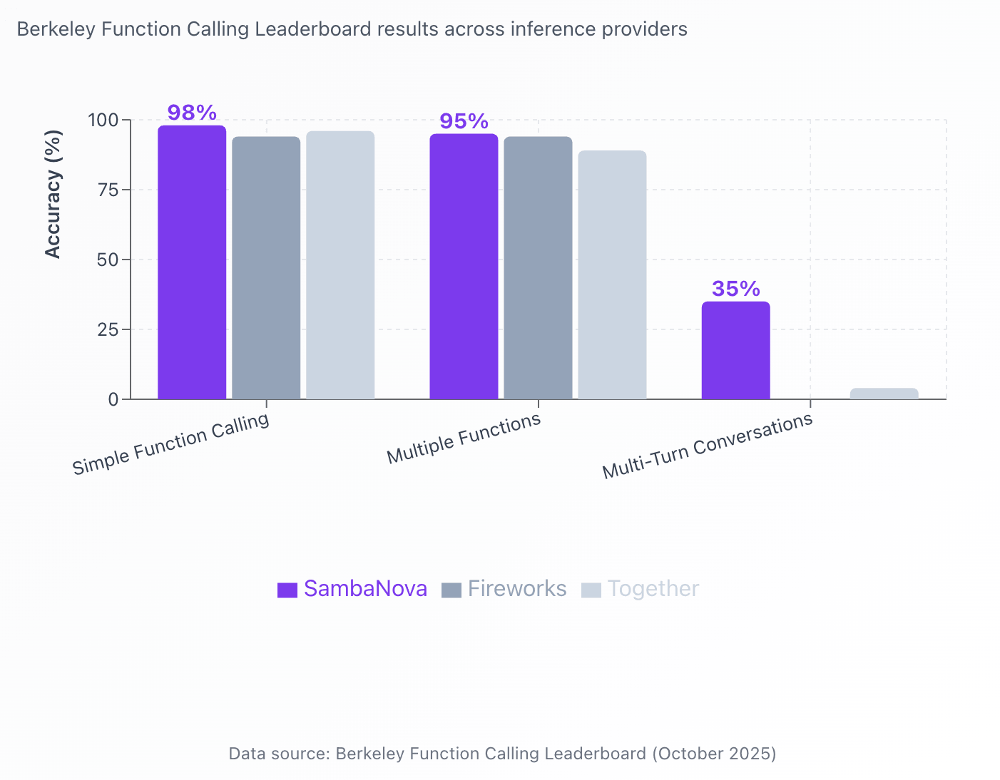
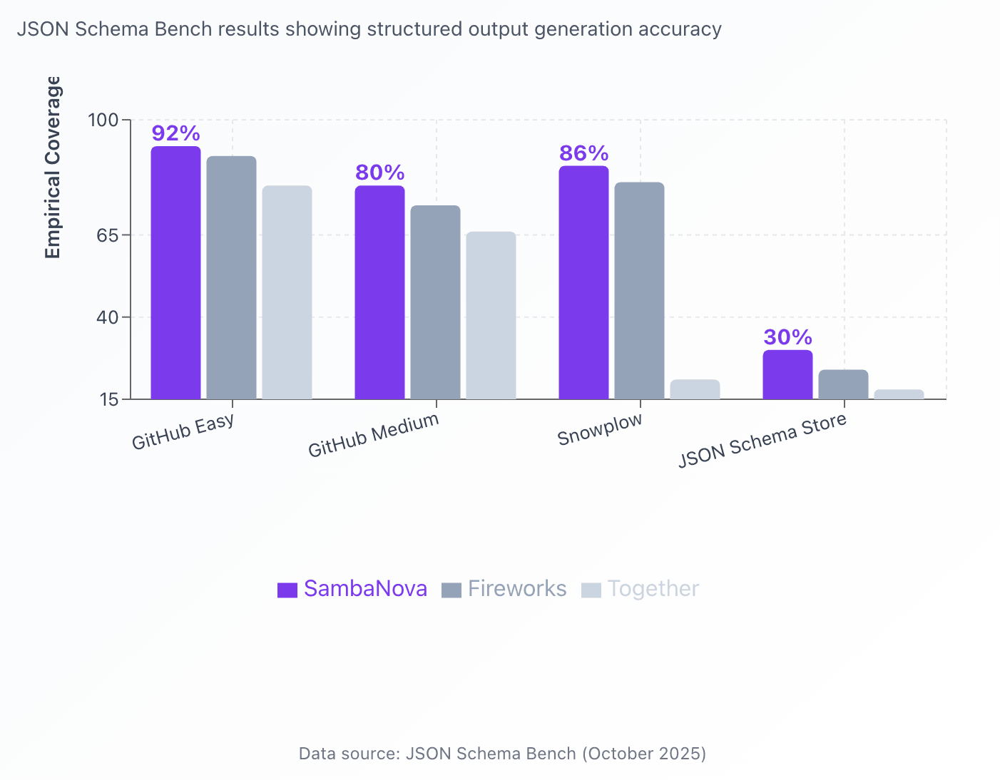
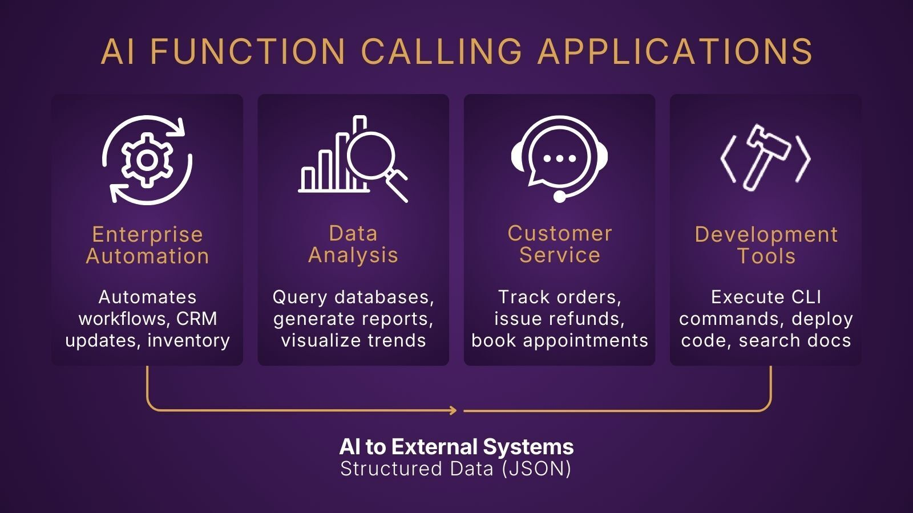

# Same Model, Three Platforms: What Function Calling Benchmarks Reveal
> 原文链接: https://sambanova.ai/blog/same-model-three-platforms-what-function-calling-benchmarks-reveal

---

[BACK TO RESOURCES](https://sambanova.ai/resources)

[Blog](https://sambanova.ai/resources/tag/blog)

# Same Model, Three Platforms: What Function Calling Benchmarks Reveal

by **Kwasi Ankomah**

December 23, 2025

When it comes to function calling and structured output generation, not all platforms deliver equal results — even with identical models. SambaNova's infrastructure advantages translate to measurably superior performance across simple tasks, complex scenarios, and production-critical structured output generation. Infrastructure-level differences in how platforms handle inference, memory, and stability compound into measurable accuracy gaps.

## **Why Function Calling Accuracy Matters in Production**

Function calling transforms language models from conversational interfaces into actionable systems. When a user asks "What's the weather in San Francisco?", function calling allows the model to invoke a weather API, retrieve data, and present the answer — all autonomously. It's the bridge between natural language and structured digital tools.
This is harder than it sounds. The model must select the right function from a set of options, extract parameters from ambiguous input, and format the output precisely. Chain multiple calls together or add multi-turn context, and error rates climb quickly.
Here's what is often overlooked: Function calling performance varies by provider, even for the same model. Each platform implements its own inference stack, tool parsing, and output formatting. The model weights are identical, but the infrastructure around them isn't.

A 90% accuracy rate sounds impressive until you realize that 1 in 10 customer requests fail.

## **Putting Performance to the Test**

To understand how platform infrastructure affects function calling and structured output performance, we conducted comprehensive testing using two industry-standard benchmark suites. We evaluated the same models, DeepSeek-V3 and Llama-4-Maverick-17B, across multiple inference providers: Fireworks, Together AI, and SambaNova.

**The Berkeley Function Calling Leaderboard** evaluates models across increasingly complex scenarios:

-   Simple function calls (single function, straightforward parameters)
-   Multiple function selection (choosing from many options)
-   Multi-turn conversations (function calls across dialogue exchanges)

More information can be found here: [https://gorilla.cs.berkeley.edu/leaderboard.html](https://gorilla.cs.berkeley.edu/leaderboard.html)

**The JSON Schema Bench** tests structured output generation—critical for ensuring function parameters are correctly formatted across diverse real-world schemas from GitHub repositories, data visualization tools, and production applications.

Stay current on the latest AI news & insights

[Sign up now](https://sambanova.ai/stay-on-top-of-ai)

## **
DeepSeek-V3 Results:**

* * *

#### Key Insight: SambaNova delivers superior performance across all function calling complexity levels with DeepSeek-V3, achieving up to 31 percentage points higher accuracy in multi-turn scenarios.

* * *

When testing DeepSeek-V3, one of the most advanced open-source models available, the platform advantage becomes unmistakable.

Even with straightforward single-function calls, infrastructure optimization delivers measurable gains. SambaNova achieved **98% accuracy** with DeepSeek-V3 — the highest among all providers. Together AI reached 96%, while Fireworks achieved 94%.

### **Multiple Function Scenarios: Complexity Amplifies the Gap**

The performance advantage grows more pronounced as tasks increase in complexity. When models must select from multiple available functions and coordinate their execution, SambaNova's infrastructure optimization shines. With DeepSeek-V3, SambaNova reached **95% accuracy** in multiple function calling scenarios, compared to 94% for Fireworks and 89% for Together AI.

That 6 percentage points lead over Together AI translates to 40% fewer errors — a dramatic improvement in system reliability that directly impacts user satisfaction and operational costs.

### **Multi-Turn Conversations: The Ultimate Challenge**

The most demanding test involves maintaining function calling accuracy across multi-turn conversations, where context must persist and models must reference previous interactions. This remains challenging industry-wide, but the infrastructure gap is stark.

SambaNova achieved **35% accuracy** with DeepSeek-V3 on multi-turn function calling — dramatically outperforming Together AI's 4%. While absolute performance levels indicate this remains a frontier challenge, SambaNova's 31 percentage points advantage demonstrates how infrastructure optimization enables capabilities that are otherwise nearly impossible.

## **Structured Output Excellence: JSON Schema Performance**

Function calling reliability fundamentally depends on generating perfectly formatted JSON. A misplaced bracket, incorrect data type, or malformed structure breaks the entire execution chain. The JSON Schema Bench evaluates this critical capability across diverse real-world schemas.

* * *

#### Key Insight: SambaNova leads across all JSON schema categories with DeepSeek-V3, demonstrating superior structured output generation for production applications.

* * *

Testing DeepSeek-V3 across four distinct schema categories, SambaNova led in four:

**GitHub Easy Schemas**: SambaNova achieved **92% coverage**, compared to 89% for Fireworks and 80% for Together AI.

**GitHub Medium Schemas**: SambaNova reached **80% coverage**, outperforming Fireworks (74%) and Together AI (66%) by substantial margins.

**Snowplow Schemas** (complex data visualization): SambaNova delivered **86% coverage** — 65-percentage-points ahead of Together AI's 21% and 5 points ahead of Fireworks' 81%.

**JSON Schema Store** (diverse real-world schemas): SambaNova achieved **30% coverage**, the highest among all providers, with Fireworks at 24% and Together AI at 18%.

The pattern is unmistakable: Across nearly every category and complexity level tested, SambaNova's infrastructure enables measurably superior structured output generation with DeepSeek-V3.

## **Why Function Calling Is Your AI's Make-or-Break Feature**

Function calling turns language models from purely conversational systems into actionable, agentic systems. As enterprises shift toward agentic AI — where models plan, decide, and execute across tools — function calling becomes the critical bridge that connects natural language reasoning to real-world applications that now exist everywhere.

The applications are everywhere:

-   **Enterprise automation**: Processing invoices, updating CRM systems, triggering workflows
-   **Data analysis**: Querying databases, generating reports, extracting structured information
-   **Customer service**: Booking appointments, checking order status, processing returns
-   **Development tools**: Writing code, executing tests, deploying applications

## **Production Implications**

**Reduced Failure Rates**: Fewer failed calls means less retry logic, less error handling, and fewer frustrated users.

**Lower Operational Costs**: Failed calls consume tokens, trigger retries, and sometimes require human intervention. Even a few percentage points of accuracy improvement compounds over thousands of daily requests.

**Faster Development Cycles**: The gap between 89% and 98% accuracy is the difference between debugging edge cases and shipping features.

**Predictability**: Production systems need consistent results, not just good average performance.

Choosing the right platform today sets the foundation for your AI system's long-term reliability.

#### Ready to experience the SambaNova difference? Explore our benchmarks, test our platform, or [contact our team](https://sambanova.ai/contact) to discuss your production AI requirements.

Share this

[Share on X](https://x.com/intent/post?url=https://sambanova.ai/blog/same-model-three-platforms-what-function-calling-benchmarks-reveal&text=Same+Model%2C+Three+Platforms%3A+What+Function+Calling+Benchmarks+Reveal) [Share on Facebook](https://www.facebook.com/sharer/sharer.php?u=https://sambanova.ai/blog/same-model-three-platforms-what-function-calling-benchmarks-reveal&t=Same+Model%2C+Three+Platforms%3A+What+Function+Calling+Benchmarks+Reveal) [Share on LinkedIn](https://www.linkedin.com/shareArticle?mini=true&url=https://sambanova.ai/blog/same-model-three-platforms-what-function-calling-benchmarks-reveal&t=Same+Model%2C+Three+Platforms%3A+What+Function+Calling+Benchmarks+Reveal)

Previous story

[← Why Modern AI Infrastructure Demands Model Bundling, Not One-Model-Per-Node Thinking](https://sambanova.ai/blog/modern-ai-infrastructure-demands-model-bundling)

Next story

[AI Is No Longer About Training Bigger Models — It’s About Inference at Scale →](https://sambanova.ai/blog/ai-is-no-longer-about-training-bigger-models-its-about-inference-at-scale)